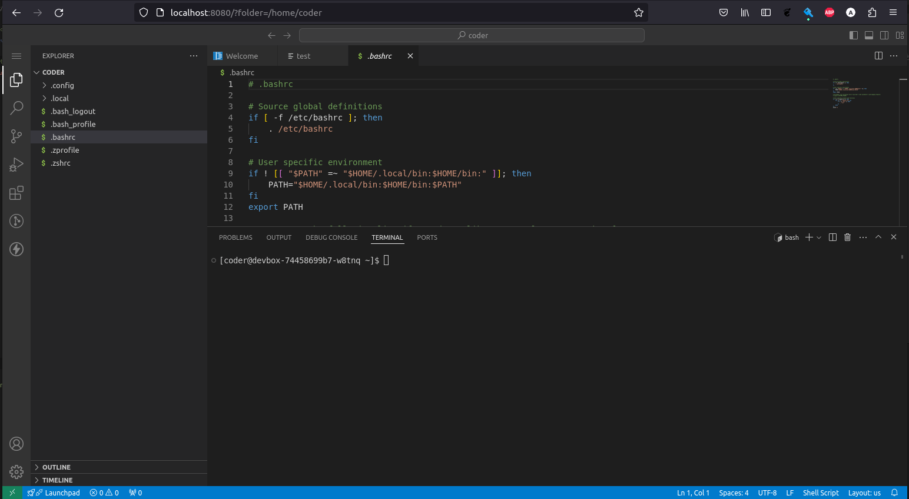

# DevBox
My personal container image based on [code-server](https://github.com/coder/code-server) with a list of additional tools like:

| List of tools         |
| --------------------- |
| yq                    |
| vim                   |
| helm                  |
| kubectl               |
| oc                    |
| k9s                   |
| netcat                |
| openssl               |
| tig                   |
| extra VSC extensions  |
| go-httpbin            |
| awscli                |
| skopeo                |

# Installation
Depending on the preference, there are two methods available
- manifests
- helm chart

## Manifests

See the ``deploy\manifests`` folder for the YAML manifests with kustomize which can be used for the installation.
You can easily install it by running:

```bash
kubectl apply -k deploy/manifests/
```

## Helm Chart

See the ``deploy\charts\devbox`` for more information.

# Configurartion

The image already contains few VSC extensions like GitLens, YAML parser or Thunder Client. If the pod has access to the internet, you can easily add more plugins however they won't persist POD restart if you don't customize installation.

## Access

Usually the POD can be accessed via port forward like:

```bash
kubectl port-forward svc/devbox 8080:8080 --address 0.0.0.0
```

or via ingress if correctly configured. See available options in Helm Chart for more information.



By default the /home/coder/data folder is persistent and here you should place all the code you edit and wish you persist the container restarts.